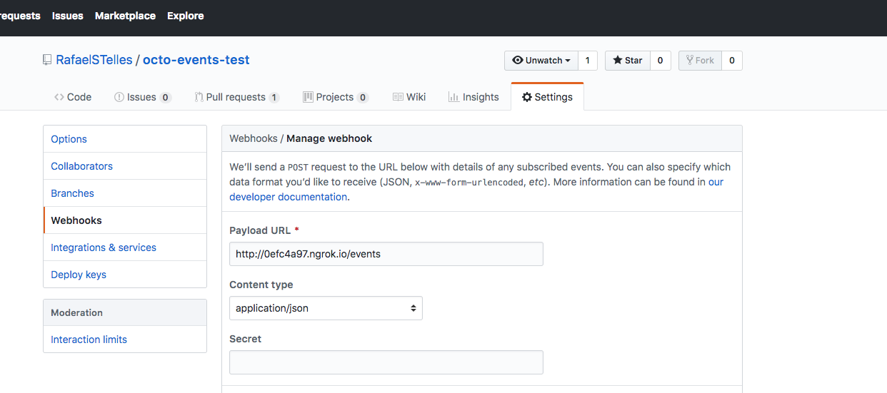
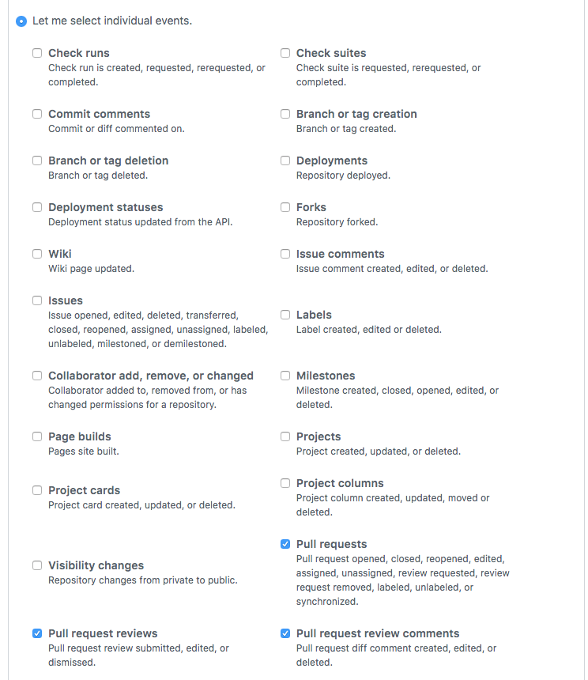
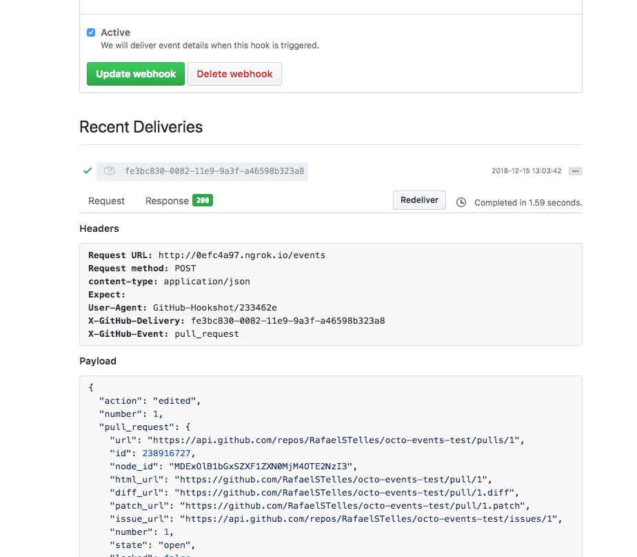
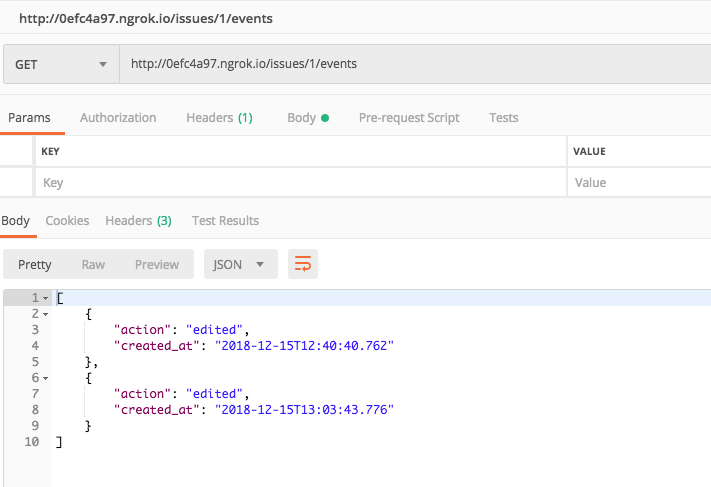

###Octo Events

O projeto foi feito utilizando Spring Boot + java 8. Abaixo segue as configurações em que foi desenvolvido o projeto

####Configurações de desenvolvimento
* JDK: 1.8.0_91
* Maven 3.3.9
* IDE de desenvolvimento: Intellij IDEA

####Para rodar o projeto é preciso realizar dois passos
* Criar um database no postgres chamado octo_events no postgres	 `create database octo_events;`
* Executar o comando `mvn clean verify && java -jar target/octo-events-1.0-SNAPSHOT.jar` dentro da pasta raíz do projeto

####Informações complementares
* Por opção própria decide deixar a opção `spring.jpa.hibernate.ddl-auto` como `create`, para que a cada subida do server ele recrie o banco. Preferi deixar assim para facilitar o desenvolvimento e por optar por não utilizar ferramentas de migrations, como Flyway e Liquibase.
* Para rodar os testes em cima do mesmo banco de dados utilizado pela aplicação, utilizei a depdencia [otj-pg-embedded](https://github.com/opentable/otj-pg-embedded). Ela disposinibiliza um postgres para ser utilizado em memória para rodar os testes

####Informações complementares
* Para realizar testes integrados ao Github, criei um repositório para os testes e fiz a seguinte configuração, conforme prints abaixo.

Eu configurei para enviar somente os webhooks de pull_request, pois pela imagem de exemplo que é disponibilizado por vocês, os posts que estão chegando tem action e number, e olhando os eventos não são todos tem que essa informação no nó principal, por esse motivo escolhi esses webook.

* Para realizar o teste do get, para buscar todas os os eventos de uma issue, utilizei o postman, conforme print abaixo.
* 

* O repositório que utilizei no github está disponível nesse link https://github.com/RafaelSTelles/octo-events-test. Através do link é possível visualizar também o pull_request (e suas alterações) que eu utilizei para realizar o teste. 